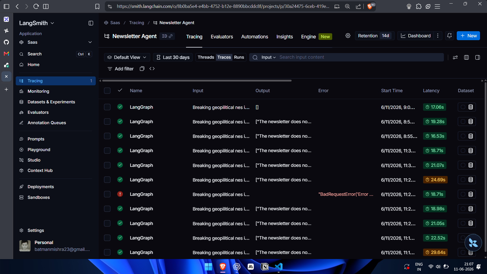

# Geopolitical Newsletter Agent

An autonomous, self-correcting AI agent that researches, scores, and delivers geopolitical briefings. Built with **LangGraph** for agentic orchestration and **Django Ninja** for backend.

 > Optimized LLM agent pipeline achieving ~75% latency reduction and 6x improvement in tail latency (P99)

   ## Problem
   Manually researching news takes more than an hour daily.
   
   ## Solution
   A multi-step agentic pipeline that:
   - Retrieves real-time news using Tavily
   - Ranks high-impact articles via LLM-based scoring
   - Extracts clean article content using lightweight parsing
   - Generates structured HTML newsletters
   - Validates outputs using a reflection loop to reduce hallucinations
   - Delivers newsletters asynchronously via background workers(for production background workers are not used due to free tier limits of Railway)

## Performance Optimisation

This system was iteratively optimised using LangSmith tracing to identify and eliminate bottlenecks.
Using LangSmith tracing, I identified latency bottlenecks and reduced newsletter generation time from 95-120s to under 20s for typical runs.

  <p align="center">
  
</p>

### Before Optimisation
- End-to-end latency: ~95–120s (P50)
- Tail latency: ~180s (P99)
- Crawl step: ~60s (browser-based scraping)
- Token usage: ~40k per run

### After Optimization

- End-to-end latency: ~18-22s (P50)
- Tail latency: ~25-30s (P99)
- Crawl step: ~4-8s (Trafilatura-based extraction)
- Token usage: <15k per run

  <p align="center">
  
</p>

**Insight:**  
Initial runs showed high variance (P99 ~180s), indicating unstable performance due to slow crawling. After optimisation, both P50 and P99 stabilised (~25–30s), significantly improving reliability.

---

<p align="center">
  
</p>

**Insight:**  
The crawl stage dominated latency (~60s) before optimisation. Replacing browser-based scraping with lightweight parsing reduced crawl time to ~4–8s, eliminating the primary bottleneck.
Occasional spikes in the generation node are due to external API rate limits (Gemini free tier), not system inefficiencies.

### Key Improvements
- Replaced browser-based (Crawl4AI) scraping with lightweight HTTP parsing (trafilatura)
- Reduced redundant LLM context → lower token cost
- Offloaded email delivery via Celery + Redis (non-blocking execution)

> Result: ~75% latency reduction and ~6x improvement in tail latency (P99)

## Architecture

<p align="center">
  
</p>

1. **Search & Discovery**: Dynamically queries real-time news via Tavily, focusing on trade, conflict, and energy security.
2. **Impact Scoring**: An LLM-based filter that scores news (1-10) to eliminate noise and select the top 6 high-impact stories.
3. **Content Extraction**: Uses `trafilatura` to extract clean ad-free text from HTML.
4. **Editorial Generation**: Bakes raw data into a professional HTML template using Jinja2.
5. **Quality Reflection**: A dedicated node that checks for hallucinations or formatting errors. If "revise" is triggered, the agent loops back to re-draft the newsletter.

---

## Why This Matters

- Reduces daily manual research time from ~1 hour to ~25 seconds
- Ensures consistent, high-quality geopolitical summaries
- Demonstrates real-world LLM system optimization (latency, cost, reliability)

## Tech Stack
- **Framework**: Django Ninja (FastAPI-style performance with Django robustness)
- **Agent Orchestration**: LangGraph (Stateful, multi-step workflows)
- **LLMs**: Gemini 3.1 Flash/ llama3.1 8b by Cerebras for Generation and llama3.1-8b by Cerebras for Scoring Node.
- **Data Fetching**: Trafilatura & Tavily Search API
- **State Management**: Pydantic v2 & Postgres Checkpointing
- **Background Tasks**: Celery (Worker) and Redis (Queue) for Email Publish Offloading to further reduce User Perceived Latency(for production constraints, no offloading).

---

## Technical Highlights
- **Agentic Loops**: Implemented a conditional router that manages state transitions.
- **State Persistence**: Used `PostgresSaver` for thread-based conversation history and state recovery.
- **Production Infrastructure**: Designed a API layer with Pydantic settings and SMTP integration for automated delivery.

---

## Live Demo
**Try it now:** https://aman-times-newsletter.up.railway.app/api_v1/docs


### Setup
```bash
git clone https://github.com/batman00723/Aman-Times-Newsletter.git
cd Aman-Times-Newsletter
pip install -r requirements.txt
python manage.py migrate
python manage.py runserver
